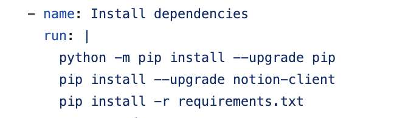

# 将微信读书划线和笔记同步到Notion

 
  <kbd>
    
  </kbd>

预览效果：https://www.notion.so/2af7c981ef1281a692f6c9d103b16604?v=2af7c981ef1281e083e1000c7296b91c

## 关于 weread2notion 的几个问题处理：
### 一、Error: Process completed with exit code 1.
- File "/home/runner/work/weread2notion/weread2notion/scripts/weread.py", line 399, in <module>
    latest_sort = get_sort()
- File "/home/runner/work/weread2notion/weread2notion/scripts/weread.py", line 225, in get_sort
    response = client.databases.query(
- AttributeError: 'DatabasesEndpoint' object has no attribute 'query'

#### 1. 在weread.yml中添加 pip install --upgrade notion-client（如图所示）。

 
  <kbd>
    
  </kbd>

#### 2.在requirements.txt中添加“notion-client==1.0.0”

### 二、Error: Cookie登陆过期
- {'errCode': -2012, 'errMsg': '登录超时', 'errLog': 'C8lA5Z6', 'info': ''} Error: Process completed with exit code 1.
#### 1. 在setting中手动更新cookie。

## 使用
> [!WARNING]  
> 请不要在Page里面添加自己的笔记，有新的笔记的时候会删除原笔记重新添加。

